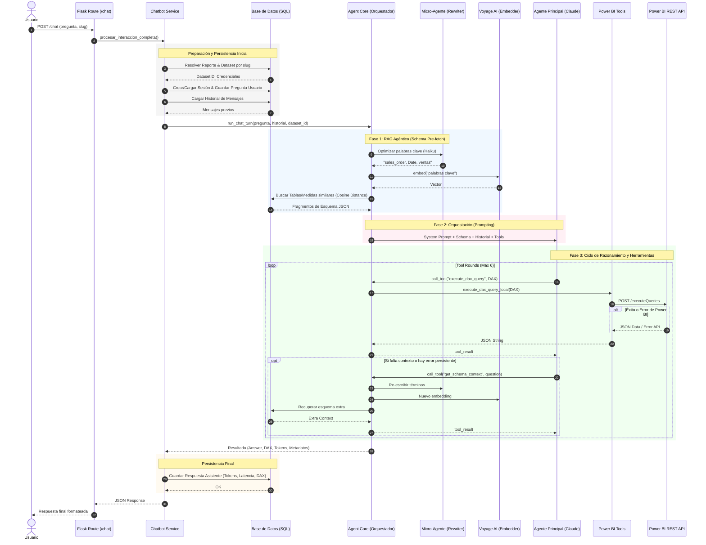

# Flujo Agéntico de Power BI Chat

Este diagrama describe el flujo actual de orquestación en `app/services/agent_core.py`.

## Detalles Técnicos
- **Micro-Agente:** Utiliza `claude-haiku-4-5-20251001` para optimizar los términos de búsqueda.
- **Voyage AI:** Modelo `voyage-4` para embeddings de alta precisión en el dominio semántico.
- **Agente Principal:** Orquestador basado en Claude que maneja la lógica de negocio y generación de DAX.
- **Autocorrección:** Si la API de Power BI devuelve un error, el Agente Principal recibe el mensaje de error y utiliza sus reglas de sintaxis DAX para intentar una corrección en la siguiente ronda.
