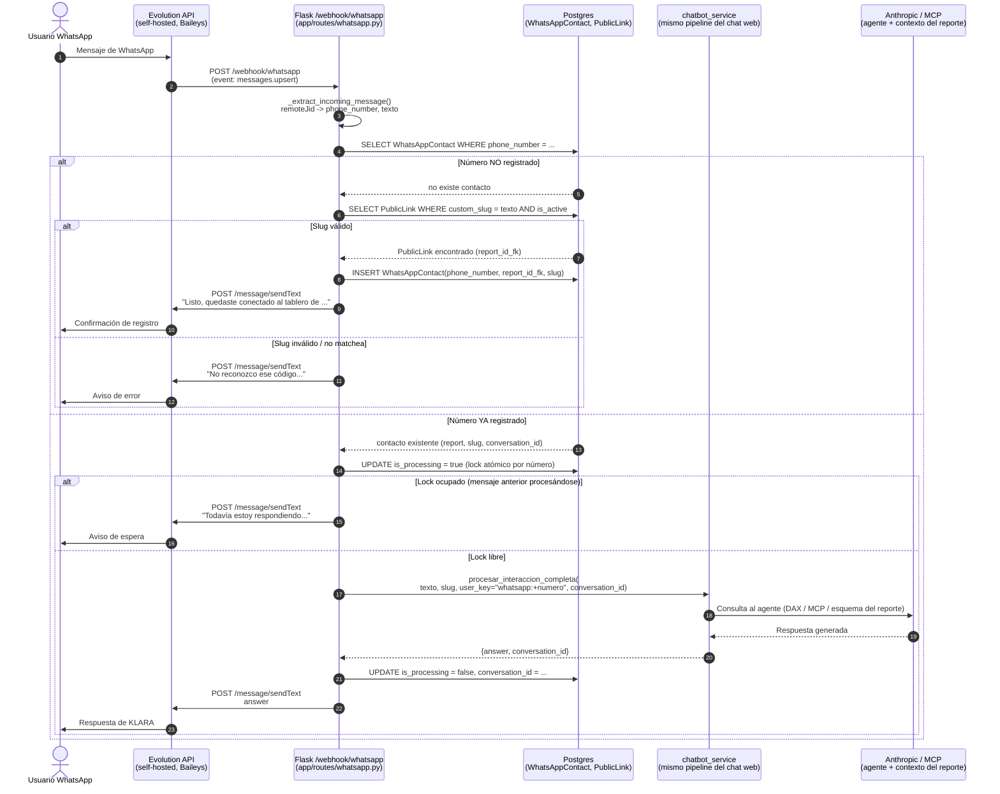

# Integración de WhatsApp para KLARA

Estado: **MVP funcional, validado end-to-end con mensajes reales.** Pendiente de decisiones de producto antes de habilitar para clientes reales.

## 1. Qué hace

Permite que un usuario le escriba a un número de WhatsApp y converse con KLARA (el mismo agente que responde en el chat web) sobre un tablero Power BI específico.

Flujo:

1. Evolution API (self-hosted, basado en [Baileys](https://github.com/WhiskeySockets/Baileys)) recibe el mensaje de WhatsApp y lo reenvía vía webhook a nuestro backend.
2. Si el número no está registrado, el **primer mensaje se interpreta como código de registro**: debe matchear exactamente un `PublicLink.custom_slug` activo (el mismo slug que se usa para el link público del tablero). Si matchea, el número queda vinculado a ese reporte para siempre.
3. Si el número ya está registrado, el mensaje se reenvía a `chatbot_service.procesar_interaccion_completa(...)` (el mismo pipeline que usa el chat web) con `user_key=f"whatsapp:{phone_number}"`, y la respuesta se manda de vuelta por WhatsApp.

### 1.1 Diagrama de secuencia



## 2. Componentes y archivos

| Archivo | Rol |
|---|---|
| [app/routes/whatsapp.py](../app/routes/whatsapp.py) | Blueprint con el webhook `POST /webhook/whatsapp` (y `/webhook/whatsapp/<event_suffix>` — ver §5.1). Maneja registro, lock de concurrencia por número, y reenvío al chatbot. |
| [app/services/evolution_client.py](../app/services/evolution_client.py) | Cliente HTTP delgado: `send_text_message(phone_number, text)` contra Evolution API. |
| [app/models.py](../app/models.py) | Modelo `WhatsAppContact` — vincula `phone_number` (único) ↔ `report_id_fk` ↔ `slug` ↔ `conversation_id`. |
| [migrations/versions/7f3a9c2e1b6d_add_whatsapp_contacts.py](../migrations/versions/7f3a9c2e1b6d_add_whatsapp_contacts.py) | Crea la tabla `whatsapp_contacts`. Ya aplicada en la base de producción. |
| [docker-compose.yml](../docker-compose.yml) | Servicios `evolution-db` (Postgres), `evolution-redis`, `evolution-api`, `evolution-manager` (UI). |
| [.evolution-manager/nginx.conf](../.evolution-manager/nginx.conf) | Override del nginx.conf bundleado en la imagen del Manager — la imagen oficial trae un bug (ver §5.4). |

### Modelo `WhatsAppContact`

```
phone_number   str, único, índice   # E.164 sin '+', ej "5493624021617"
report_id_fk   FK -> reports.id
slug           str                   # el PublicLink.custom_slug usado para registrarse
conversation_id FK -> chat_sessions.id, nullable
is_processing  bool                  # lock para serializar mensajes concurrentes del mismo número
created_at / last_message_at
```

**Expiración opcional vía `WHATSAPP_CONTACT_TTL_HOURS`.** Por defecto (variable sin definir o en `0`) el vínculo número↔reporte es permanente, igual que antes. Si se define un valor (ej. `1`), `_find_contact_sync` en [whatsapp.py](../app/routes/whatsapp.py) borra automáticamente el row la próxima vez que ese número escribe, una vez pasadas esas horas desde `created_at` — sin job en background, es expiración perezosa evaluada en el próximo mensaje. Pensado para pruebas: permite reusar el mismo número para probar el flujo de registro una y otra vez sin borrar manualmente de la base. **No usar esta variable en producción** (o dejarla sin definir), salvo que se quiera que los vínculos expiren de verdad.

## 3. Cómo registrar un número para pruebas

El primer mensaje de un número nuevo debe ser **exactamente** uno de los `custom_slug` activos con `chatbot_enabled=True` en `Report`. Slugs disponibles al momento de escribir esto:

- `dash-miguitas` → "Miguitas - Fudo"
- `agsa-ventas` → "Agsa - Ventas"
- `parino-eerr` → "Parino EERR"

(Esta lista cambia con el tiempo — consultar `PublicLink` join `Report` filtrando `is_active=True` y `chatbot_enabled=True` para la lista vigente.)

## 4. Infraestructura de Evolution API

### 4.1 Por qué Evolution API

Es un wrapper REST self-hosted sobre Baileys (librería no oficial de WhatsApp Web). No requiere aprobación de Meta ni WhatsApp Business API oficial — corre como un "dispositivo vinculado" más, igual que WhatsApp Web/Desktop.

### 4.2 Imagen Docker — usar `evoapicloud/evolution-api`, NO `atendai/evolution-api`

El docker-compose original usaba `atendai/evolution-api:latest`, pero ese namespace en Docker Hub está **congelado en v2.2.3 desde febrero 2025**. Migramos a `evoapicloud/evolution-api:latest` (mismo proyecto, mantenido activamente, v2.3.7 al momento de escribir esto). Esto fue necesario para resolver el problema de LID (§5.3).

### 4.3 Variables de entorno clave (en `docker-compose.yml`)

```yaml
CACHE_REDIS_ENABLED: "true"        # requerido — sin esto, los webhooks NO se entregan (§5.2)
CACHE_REDIS_URI: redis://evolution-redis:6379/6
CONFIG_SESSION_PHONE_VERSION: "2.3000.1035194821"   # pin de versión de WA Web (§5.1)
DATABASE_SAVE_DATA_CHATS/CONTACTS/HISTORIC/LABELS: "false"  # reduce carga de sync
WEBHOOK_GLOBAL_ENABLED: "false"    # el webhook se configura por instancia, no global (§5.5)
```

### 4.4 Evolution Manager (UI web)

Agregamos el servicio `evolution-manager` para poder escanear el QR (con auto-refresh) y ver el estado de conexión desde un navegador, sin tener que pedirle el QR a la API manualmente cada vez.

- URL local: `http://localhost:9615`
- Login: Server URL = `http://localhost:8080` (o la URL pública si está en un servidor), API Key = `EVOLUTION_API_KEY` del `.env`.

## 5. Bugs encontrados y resueltos durante la validación

### 5.1 QR nunca se generaba (loop infinito de reconexión)

**Síntoma:** `/instance/connect` devolvía `{"count":0}` indefinidamente; los logs mostraban un ciclo de reconexión cada 3-5 segundos sin parar.

**Causa:** la versión de WhatsApp Web (`CONFIG_SESSION_PHONE_VERSION`) embebida por defecto en la imagen estaba desactualizada respecto a lo que WhatsApp acepta hoy, causando rechazo silencioso de la conexión.

**Fix:** pinear `CONFIG_SESSION_PHONE_VERSION` a una versión reciente, obtenida de [`baileys-version.json`](https://raw.githubusercontent.com/WhiskeySockets/Baileys/master/src/Defaults/baileys-version.json) (este archivo cambia con el tiempo — si vuelve a fallar la generación del QR, revisar si hay que actualizar este valor).

### 5.2 Webhooks nunca llegaban a Flask (sin error visible)

**Síntoma:** los logs de Evolution mostraban "intención de envío" (`WebhookController` log) para cada evento, pero Flask nunca recibía la request. Sin errores en ningún lado.

**Causa:** Evolution usa BullMQ (cola de jobs sobre Redis) para el despacho real de webhooks. Habíamos desactivado Redis como mitigación al problema del QR (§5.1) — eso rompió la entrega de webhooks sin generar ningún log de error.

**Fix:** reactivar Redis (`CACHE_REDIS_ENABLED: "true"` + servicio `evolution-redis`). El fix real del QR era el pin de versión (§5.1), no la desactivación de Redis — así que se puede tener ambos.

### 5.3 LID — WhatsApp no entrega el número de teléfono real

**Síntoma:** en v2.2.3, los webhooks de mensajes entrantes traían `remoteJid` en formato `@lid` (ej `93669025652871@lid`) en vez de `@s.whatsapp.net`. Nuestro código asume que `remoteJid.split("@")[0]` es un número de teléfono real — al intentar responder, Evolution API rechazaba el envío (`exists: false`) porque ese "número" no es válido.

**Contexto:** WhatsApp está migrando a un sistema de identificadores privados (LID) en reemplazo del número de teléfono crudo, por motivos de privacidad. Esto rompe cualquier integración que asuma `remoteJid` = número de teléfono.

**Fix:** actualizar a `evoapicloud/evolution-api:v2.3.7`, que sí resuelve LID → número real en el payload del webhook (`key.remoteJid` viene como `@s.whatsapp.net` aunque `key.addressingMode` siga reportando `'lid'` internamente). Confirmado con mensajes reales de 3 contactos distintos — el bot pudo responderles correctamente.

**Riesgo residual:** la resolución LID→número depende de que Evolution/Baileys ya tengan ese contacto sincronizado. Es posible que algún contacto nuevo (sin historial) aparezca como `@lid` puro sin resolución hasta que se sincronice. No se observó este caso en las pruebas, pero el código no tiene ningún manejo explícito si volviera a pasar — `_send_reply` lo loguea como error y no rompe el webhook (gracias al fix de §5.6), pero el usuario no recibe respuesta.

### 5.4 Imagen del Evolution Manager rota (nginx no arranca)

**Síntoma:** el contenedor `evolution-manager` crashloopeaba con `nginx: [emerg] invalid value "must-revalidate" in /etc/nginx/conf.d/nginx.conf:11`.

**Causa:** bug de empaquetado en la imagen — la directiva `gzip_proxied` incluye `must-revalidate`, que no es un valor válido para esa directiva (es una mezcla con `Cache-Control`).

**Fix:** override del `nginx.conf` vía volumen ([.evolution-manager/nginx.conf](../.evolution-manager/nginx.conf)), montado en `/etc/nginx/conf.d/nginx.conf`. También se corrigió el mapeo de puerto: el contenedor escucha en el puerto **80** interno, no 9615 (`ports: "9615:80"`).

### 5.5 Webhook duplicado (respuestas dobles)

**Síntoma:** el bot respondía dos veces el mismo mensaje.

**Causa:** teníamos webhook configurado **dos veces simultáneamente** — a nivel de instancia (vía `POST /webhook/set/{instance}`) y a nivel global (`WEBHOOK_GLOBAL_ENABLED=true` + `WEBHOOK_GLOBAL_URL`). Ambos disparaban independientemente para el mismo evento.

**Fix:** `WEBHOOK_GLOBAL_ENABLED: "false"` en el compose. El webhook se configura **solo por instancia**, vía `POST /webhook/set/{instance}` — **se pierde si la instancia se borra y se recrea**, hay que volver a correrlo (ver §6).

### 5.6 Rutas de webhook con sufijo de evento (404)

**Síntoma:** Evolution mandaba las requests reales a `/webhook/whatsapp/messages-upsert` (con el nombre del evento como sufijo de path), pero el blueprint solo registraba `/webhook/whatsapp` exacto → 404.

**Fix:** la ruta acepta ambas formas:
```python
@bp.route("/webhook/whatsapp", methods=["POST"], defaults={"event_suffix": None})
@bp.route("/webhook/whatsapp/<path:event_suffix>", methods=["POST"])
async def whatsapp_webhook(event_suffix):
```
El sufijo se ignora — el payload ya trae el campo `event` que el código usa para filtrar.

### 5.7 Excepción no controlada en `_send_reply`

**Síntoma:** 500 sin control en el webhook cuando el envío de la respuesta fallaba por timeout de red (no por un 4xx de la API).

**Causa:** `_send_reply` solo atrapaba `evolution_client.EvolutionClientError` (errores HTTP ≥400), no errores de red/timeout (`requests.exceptions.RequestException`).

**Fix:** ampliar el except:
```python
except (evolution_client.EvolutionClientError, requests.exceptions.RequestException):
    logging.exception(...)
```

### 5.8 TTL de prueba expiraba los contactos casi al instante (bug de zona horaria)

**Síntoma:** al implementar `WHATSAPP_CONTACT_TTL_HOURS` (§2), un contacto recién registrado volvía a pedir el código de registro en el mensaje siguiente (segundos después), mucho antes de cumplirse la 1 hora configurada.

**Causa:** la columna `created_at` es `db.DateTime` **sin** timezone, poblada con `_utcnow()` (un datetime *aware* en UTC). La sesión de Postgres tiene `timezone = America/Argentina/Buenos_Aires` (UTC-3) — al insertar un valor *aware* en una columna sin tz, Postgres lo convierte a la zona horaria de la sesión y guarda esa hora local como si fuera naive. El código leía ese valor naive y lo re-etiquetaba como UTC (`replace(tzinfo=timezone.utc)`), introduciendo un error de +3 horas en el cálculo de antigüedad — suficiente para que cualquier contacto, sin importar cuán reciente, pareciera ya vencido contra un TTL de 1 hora.

**Fix:** la comparación de antigüedad se hace **del lado de la base**, no en Python:
```python
expired = db.session.query(
    db.session.query(WhatsAppContact.id)
    .filter(
        WhatsAppContact.id == contact.id,
        func.now() - WhatsAppContact.created_at > timedelta(hours=ttl_hours),
    )
    .exists()
).scalar()
```
`func.now()` y `created_at` se comparan dentro del mismo contexto de sesión/timezone de Postgres, así que la resta da la duración real sin importar qué timezone tenga configurada la sesión.

## 6. Procedimiento manual post-creación de instancia

Cada vez que se borra y recrea la instancia `klara-mvp` en Evolution API (cosa que pasó varias veces durante la depuración), hay que repetir:

```bash
# 1. Crear instancia
curl -X POST "http://<host>:8080/instance/create" \
  -H "apikey: $EVOLUTION_API_KEY" -H "Content-Type: application/json" \
  -d '{"instanceName":"klara-mvp","integration":"WHATSAPP-BAILEYS","qrcode":true}'

# 2. Configurar webhook (se pierde al recrear la instancia, ver §5.5)
curl -X POST "http://<host>:8080/webhook/set/klara-mvp" \
  -H "apikey: $EVOLUTION_API_KEY" -H "Content-Type: application/json" \
  -d '{"webhook":{"enabled":true,"url":"http://flask-powerbi:2052/webhook/whatsapp","events":["MESSAGES_UPSERT"]}}'

# 3. Escanear QR desde el Evolution Manager (http://<host>:9615) o vía GET /instance/connect/klara-mvp
```

Esto es manual hoy — es un candidato claro a automatizar antes de producción (ver §7).

## 7. Pendiente / decisiones de producto antes de producción

- **Expiración del vínculo número↔reporte en producción**: ya existe `WHATSAPP_CONTACT_TTL_HOURS` para pruebas (ver §2), pero queda sin definir cuál debería ser el comportamiento real en producción — ¿permanente para siempre, o algún TTL largo (30 días)? Hoy en prod la variable debe quedar sin definir (permanente).
- **Automatizar la creación de instancia + webhook**: hoy es manual vía curl/Manager. Si se va a recrear la instancia regularmente (ej. en cada deploy), conviene un script o un hook de arranque.
- **Cuenta de WhatsApp dedicada**: todas las pruebas se hicieron vinculando una cuenta **personal** de WhatsApp como dispositivo de la instancia. Para producción hace falta un número dedicado (SIM/WhatsApp Business), porque vincular una cuenta personal expone *todos* los chats de esa cuenta al webhook (ver nota de seguridad abajo).
- **Normalización de número de teléfono**: no hay normalización de formato (código de país, espacios) en el flujo de registro — asume que Evolution ya entrega el JID limpio.
- **Reintentos de registro**: si el slug no matchea, no hay límite de intentos ni cooldown — un número puede mandar slugs incorrectos indefinidamente.
- **Tests automatizados**: cero tests para este flujo todavía.
- **Riesgo residual de LID** (§5.3): sin manejo explícito si un contacto nuevo aparece sin resolución de número.

### Nota de seguridad

Vincular una cuenta de WhatsApp **personal** (no un número de negocio dedicado) hace que el dispositivo vinculado reciba eventos de **todos** los chats de esa cuenta (mensajes propios y de terceros, individuales y de grupo), no solo los dirigidos al "número del bot". El código actual filtra correctamente los mensajes `fromMe: true`, pero cualquier mensaje entrante real de cualquier contacto de esa cuenta personal pasa por el webhook y puede disparar el flujo de registro. Aceptable para pruebas con consentimiento del dueño de la cuenta; **no usar una cuenta personal en producción**.

## 8. Despliegue de prueba en AWS (descartable)

Para facilitar las pruebas (escanear QR, probar el flujo completo) sin depender de la PC local, se desplegó una copia del stack completo en una instancia EC2 temporal:

- Instancia: `i-09c8a1636b3ef1717`, tipo `t3.small`, región `sa-east-1`, AMI Ubuntu 24.04.
- Mismo `docker-compose.yml`, mismo `.env` (apunta a la misma base de producción — los slugs de §3 funcionan igual ahí).
- Acceso restringido por security group a la IP del desarrollador (puertos 22, 8080, 9615).
- Key pair: `klara-mvp-key` (clave privada solo en la máquina local que la generó).

**Esta instancia es descartable** — se creó solo para facilitar las pruebas del MVP y debe terminarse (`aws ec2 terminate-instances --instance-ids i-09c8a1636b3ef1717`) cuando se deje de necesitar, para no seguir consumiendo créditos. No es la infraestructura definitiva de producción.
