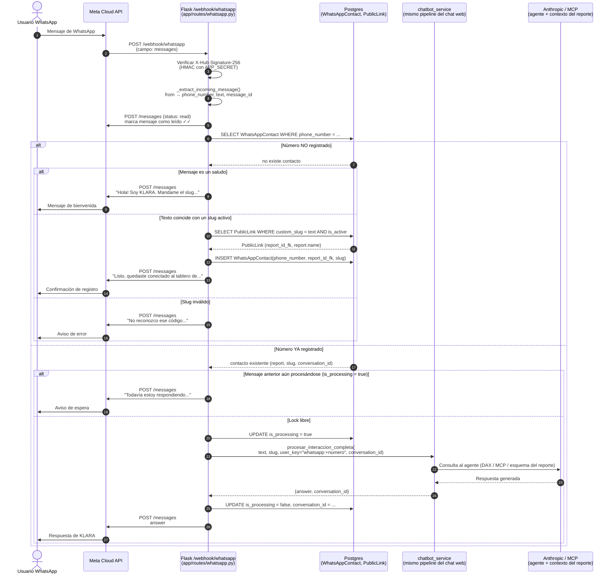

# WhatsApp Integration — Meta Cloud API

Integración de KLARA con WhatsApp Business mediante la Meta Cloud API oficial.

---

## 1. Arquitectura y flujo

### 1.1 Diagrama de secuencia



---

## 2. Componentes

| Archivo | Rol |
|---|---|
| `app/routes/whatsapp.py` | Blueprint Flask: verificación de webhook (GET) y procesamiento de mensajes (POST) |
| `app/services/meta_whatsapp_client.py` | Cliente HTTP para Meta Graph API (envío de mensajes, mark as read) |
| `app/models.py` → `WhatsAppContact` | Tabla de binding phone↔reporte |
| `migrations/versions/7f3a9c2e1b6d_*` | Migración que crea `whatsapp_contacts` |

### Modelo WhatsAppContact

```
phone_number   VARCHAR(30)  UNIQUE  — número en formato wa_id (ej: 5493624297130)
report_id_fk   FK → reports.id
slug           VARCHAR(120) — slug del PublicLink usado para el registro
conversation_id FK → chat_sessions.id (nullable, se llena tras la primera consulta)
is_processing  BOOLEAN — lock optimista para evitar respuestas duplicadas
created_at     DATETIME — usado por el TTL de testing
```

---

## 3. Variables de entorno

| Variable | Descripción |
|---|---|
| `META_WA_PHONE_NUMBER_ID` | ID del número de teléfono en Meta (ej: `1196613776875478`) |
| `META_WA_ACCESS_TOKEN` | Bearer token para la Graph API |
| `META_WA_VERIFY_TOKEN` | Token de verificación del webhook (elegido libremente) |
| `META_WA_APP_SECRET` | App Secret de la app Meta (para verificar firma HMAC del webhook) |
| `META_WA_TEST_MODE` | `true` en desarrollo — normaliza números argentinos al formato legacy de Meta |
| `WHATSAPP_CONTACT_TTL_HOURS` | Si > 0, expira el registro phone↔reporte tras N horas (solo para testing) |

---

## 4. Setup inicial en Meta Developers

1. Crear app tipo **Business** en [developers.facebook.com](https://developers.facebook.com)
2. Agregar producto **WhatsApp** → vincular al **WhatsApp Business Account (WABA)**
3. Configurar webhook:
   - **Callback URL:** `https://<dominio>/webhook/whatsapp`
   - **Verify Token:** valor de `META_WA_VERIFY_TOKEN`
   - **Campo suscripto:** `messages`
4. Suscribir la app al WABA (una sola vez):
   ```bash
   curl -X POST "https://graph.facebook.com/v20.0/<WABA_ID>/subscribed_apps" \
     -H "Authorization: Bearer <ACCESS_TOKEN>"
   ```
5. En **modo desarrollo**: agregar números de prueba en Step 1 → Try it out

---

## 5. Cómo registrar un número al chat

El usuario envía como **primer mensaje** el slug público del tablero:

```
dash-miguitas   → tablero "Miguitas - Fudo"
agsa-ventas     → tablero "Agsa - Ventas"
parino-eerr     → tablero "Parino EERR"
```

El bot confirma y a partir de ese momento responde consultas sobre ese reporte usando el mismo agente del chat web.

La relación es **1:1** — un número solo puede estar vinculado a un tablero a la vez.

---

## 6. Testing local con ngrok

```powershell
# 1. Levantar Flask
docker compose up -d flask-powerbi

# 2. Túnel HTTPS (en otra terminal)
ngrok http 2052
# → anota la URL: https://xxxx.ngrok-free.app

# 3. Registrar webhook en Meta Developers con esa URL
# Callback URL: https://xxxx.ngrok-free.app/webhook/whatsapp

# 4. Suscribir app al WABA
curl -X POST "https://graph.facebook.com/v20.0/<WABA_ID>/subscribed_apps" \
  -H "Authorization: Bearer <ACCESS_TOKEN>"
```

> **Nota:** La URL de ngrok en plan gratuito cambia cada vez que se reinicia. Hay que re-registrar el webhook en Meta cada sesión de testing.

---

## 7. Bugs conocidos y soluciones

### 7.1 `#131030` Recipient phone number not in allowed list (modo test)

**Síntoma:** El bot recibe el mensaje correctamente pero falla al responder.

**Causa:** En modo desarrollo, Meta solo permite enviar mensajes a números previamente autorizados. Los números argentinos se registran en el formato legacy (`54XXX15XXXXXXX`) pero el webhook los entrega en formato moderno (`549XXXXXXXXX`).

**Fix:** `META_WA_TEST_MODE=true` activa la normalización en `meta_whatsapp_client._normalize_ar_number()`. En producción, Meta resuelve ambos formatos automáticamente.

### 7.2 Webhooks no llegan (silencioso)

**Síntoma:** El webhook GET de verificación funciona pero no llegan POST de mensajes.

**Causa:** La app no estaba suscripta al WABA. El campo `messages` puede estar suscripto a nivel de app pero sin la suscripción al WABA los eventos no se routean.

**Fix:** Llamar `POST /<WABA_ID>/subscribed_apps` con el access token (ver §4, paso 4).

---

## 8. Decisiones pendientes para producción

- [ ] Reemplazar token temporal por **System User Token permanente** (no expira)
- [ ] Registrar el número real de Sudata (`+54 9 11 2677-0450`) en producción — actualmente solo está el número de test `+1 (555) 043-0552`
- [ ] Publicar la app en Meta para recibir webhooks de usuarios reales (hoy solo funciona con el número de test autorizado)
- [ ] Configurar dominio con HTTPS en el servidor de producción (reemplaza ngrok)
- [ ] Desactivar `META_WA_TEST_MODE` y `WHATSAPP_CONTACT_TTL_HOURS` en producción
