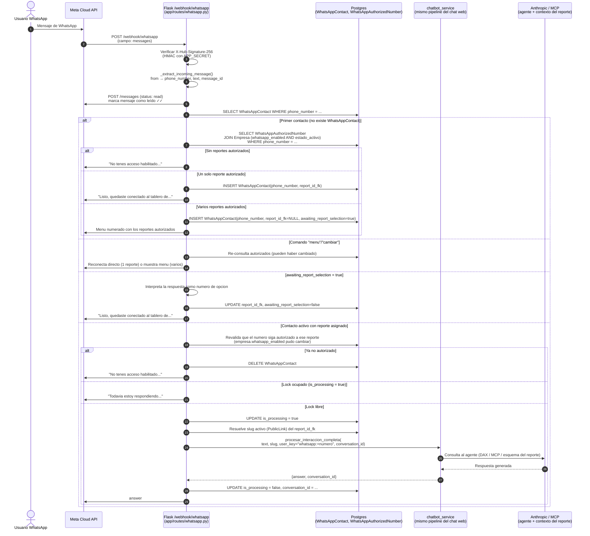

# WhatsApp Integration — Meta Cloud API

Integración de KLARA con WhatsApp Business mediante la Meta Cloud API oficial.

**Número activo:** `+54 9 11 2677-0450` — status `CONNECTED`. Phone Number ID y WABA ID en `.env` (`META_WA_PHONE_NUMBER_ID`), no se documentan acá por ser un repo público.

---

## 1. Arquitectura y flujo

El acceso ya **no** se basa en que el usuario mande el slug público del reporte. Un administrador pre-autoriza qué números pueden consultar qué reportes desde el panel de Empresas, y el bot resuelve todo automáticamente.

### 1.1 Diagrama de secuencia



> `chatbot_service.procesar_interaccion_completa` sigue pidiendo un `slug` (no se tocó). `whatsapp.py` lo resuelve en runtime buscando el `PublicLink` activo del `report_id_fk` asignado — el admin nunca necesita compartir un slug con el usuario final.

---

## 2. Componentes

| Archivo                                          | Rol                                                                                     |
| ------------------------------------------------- | ---------------------------------------------------------------------------------------- |
| `app/routes/whatsapp.py`                         | Blueprint Flask: verificación de webhook (GET) y procesamiento de mensajes (POST)       |
| `app/services/meta_whatsapp_client.py`           | Cliente HTTP para Meta Graph API (envío de mensajes, mark as read)                      |
| `app/models.py` → `WhatsAppAuthorizedNumber`     | Tabla de autorización: qué número puede acceder a qué reporte, dentro de qué empresa     |
| `app/models.py` → `WhatsAppContact`              | Binding en vivo phone↔reporte activo + estado de selección de menú                       |
| `app/models.py` → `Empresa.whatsapp_enabled`     | Toggle admin: habilita/deshabilita el chat de WhatsApp para toda la empresa              |
| `app/routes/empresas.py`                         | Endpoints admin: `toggle_whatsapp`, `add_whatsapp_number`, `remove_whatsapp_number`      |
| `app/templates/admin/empresas/detail.html`       | Panel: toggle de WhatsApp + sección "Números Asociados"                                 |
| `app/templates/admin/empresas/whatsapp_add_number.html` | Formulario para autorizar un número a uno o varios reportes de la empresa         |
| `migrations/versions/7f3a9c2e1b6d_*`             | Migración original que crea `whatsapp_contacts`                                         |
| `migrations/versions/b3d4e5f6a7c8_*`             | Migración que agrega `whatsapp_authorized_numbers` y `Empresa.whatsapp_enabled`          |

### Modelo `WhatsAppAuthorizedNumber`

```
phone_number    VARCHAR(30)  — número en formato wa_id (ej: 5493624297130)
empresa_id_fk   FK → clientes_privados.id
report_id_fk    FK → reports.id
created_at      DATETIME

UNIQUE(phone_number, report_id_fk)
```

Un número puede tener varias filas (una por reporte autorizado), pero siempre dentro de la misma empresa.

### Modelo `WhatsAppContact` (actualizado)

```
phone_number              VARCHAR(30) UNIQUE — número en formato wa_id
report_id_fk              FK → reports.id, NULLABLE (null mientras elige del menú)
awaiting_report_selection BOOLEAN — true cuando se le mostró el menú y falta que elija
conversation_id           FK → chat_sessions.id (nullable, se llena tras la primera consulta)
is_processing             BOOLEAN — lock optimista para evitar respuestas duplicadas
created_at                DATETIME
last_message_at           DATETIME
```

> El campo `slug` que existía antes fue eliminado — ya no se usa para el registro.

### Reglas de acceso

- Un número puede tener acceso a uno o varios reportes de una misma empresa.
- **Un solo reporte autorizado** → conecta directo, sin menú.
- **Varios reportes** → menú numerado; el comando `menu` o `cambiar` lo vuelve a mostrar en cualquier momento.
- **No autorizado** → mensaje genérico, sin pistas de qué reportes existen.
- El acceso también depende de `Empresa.whatsapp_enabled` **y** `Empresa.estado_activo` — se revalida en **cada mensaje**, no solo al conectar, así que desactivar el toggle corta el acceso al instante (el próximo mensaje del número recibe el aviso de "sin acceso" y se borra su `WhatsAppContact`).

---

## 3. Panel de administración

En **Empresas → detalle de una empresa**:

- **Acciones Rápidas → Habilitar/Deshabilitar WhatsApp**: togglea `Empresa.whatsapp_enabled`.
- **Números Asociados**: lista los números autorizados y su reporte. "Autorizar Número" abre un formulario para cargar un número nuevo y elegir uno o varios reportes de esa empresa (checkboxes). "Quitar acceso" borra la fila de `WhatsAppAuthorizedNumber` para ese reporte puntual.

No hace falta tocar la base de datos a mano para dar de alta un número — todo el flujo pasa por este panel.

---

## 4. Variables de entorno

| Variable                     | Descripción                                                                   |
| ----------------------------- | ------------------------------------------------------------------------------ |
| `META_WA_PHONE_NUMBER_ID`    | ID del número de teléfono en Meta                                             |
| `META_WA_ACCESS_TOKEN`       | Bearer token para la Graph API (System User permanente, no vence)             |
| `META_WA_VERIFY_TOKEN`       | Token de verificación del webhook (elegido libremente)                        |
| `META_WA_APP_SECRET`         | App Secret de la app Meta (para verificar firma HMAC del webhook)             |
| `META_WA_TEST_MODE`          | `true` en desarrollo — normaliza números argentinos al formato legacy de Meta |

En producción: `META_WA_TEST_MODE=false`.

---

## 5. Setup inicial en Meta Developers

1. Crear app tipo **Business** en [developers.facebook.com](https://developers.facebook.com)
2. Agregar producto **WhatsApp** → vincular al **WhatsApp Business Account (WABA)**
3. Configurar webhook:
   - **Callback URL:** `https://<dominio>/webhook/whatsapp`
   - **Verify Token:** valor de `META_WA_VERIFY_TOKEN`
   - **Campo suscripto:** `messages`
4. Suscribir la app al WABA (una sola vez):
   ```bash
   curl -X POST "https://graph.facebook.com/v20.0/<WABA_ID>/subscribed_apps" \
     -H "Authorization: Bearer <ACCESS_TOKEN>"
   ```
5. **Mientras la app esté en modo Development**, Meta solo entrega webhooks reales para números agregados como *tester*: **WhatsApp → API Setup → Send and receive messages → Manage phone number list → Add recipient phone number**. Se verifica el número con un código que Meta manda por WhatsApp. Esto es independiente de "App roles → Testers" (ese es para gente que accede al dashboard, no para destinatarios de mensajes).
6. Para que cualquier usuario final (no solo testers) pueda escribirle al bot, hace falta:
   - Completar **Business Verification** en Meta Business Manager (documentación legal del negocio).
   - Completar **Settings → Basic** de la app (ícono, categoría, Privacy Policy URL).
   - Pasar el toggle de la app de **Development** a **Live**.

---

## 6. Cómo autorizar un número (flujo actual)

Ya no se manda ningún slug por WhatsApp. El alta la hace un admin desde el panel:

1. Ir a **Empresas → (empresa) → Acciones Rápidas → Habilitar WhatsApp** (si no estaba habilitado).
2. En **Números Asociados → Autorizar Número**, cargar el número en formato internacional sin `+` ni espacios (ej: `5493624297130`) y marcar el/los reporte(s) a los que debe tener acceso.
3. Ese número ya puede escribirle a KLARA — sin menú si tiene un solo reporte, con menú numerado si tiene varios.

---

## 7. Testing local con ngrok

```powershell
# 1. Levantar Flask
docker compose up -d flask-powerbi

# 2. Túnel HTTPS (en otra terminal)
ngrok http 2052
# → anota la URL pública que te asigna

# 3. Registrar/actualizar el webhook en Meta Developers con esa URL
# Callback URL: https://<url-de-ngrok>/webhook/whatsapp

# 4. Suscribir app al WABA (si no estaba suscripta)
curl -X POST "https://graph.facebook.com/v20.0/<WABA_ID>/subscribed_apps" \
  -H "Authorization: Bearer <ACCESS_TOKEN>"
```

> **Nota:** con un dominio de ngrok reservado (plan pago o `--domain`), la URL no cambia entre reinicios y no hace falta re-registrar el webhook cada vez. Con el plan gratuito sin dominio reservado, la URL cambia cada sesión.
>
> **Riesgo operativo:** este setup depende de que la máquina local, Docker y el proceso de ngrok sigan corriendo. Si el túnel se cae, Meta devuelve `ERR_NGROK_3200` y el webhook queda mudo — sin ningún error visible del lado de la app (porque el request nunca llega). Antes de dar por roto el código, comprobar primero que el túnel esté vivo (`curl` directo a la Callback URL configurada en Meta).

---

## 8. Bugs conocidos y soluciones

### 8.1 `#131030` Recipient phone number not in allowed list (modo test)

**Síntoma:** El bot recibe el mensaje correctamente pero falla al responder.

**Causa:** En modo desarrollo, Meta solo permite enviar mensajes a números previamente autorizados. Los números argentinos se registran en el formato legacy (`54XXX15XXXXXXX`) pero el webhook los entrega en formato moderno (`549XXXXXXXXX`).

**Fix:** `META_WA_TEST_MODE=true` activa la normalización en `meta_whatsapp_client._normalize_ar_number()`. En producción, Meta resuelve ambos formatos automáticamente.

### 8.2 Webhooks duplicados → "Todavía estoy respondiendo" falso

**Síntoma:** El usuario recibe "Todavía estoy respondiendo tu mensaje anterior" aunque el bot ya había respondido correctamente.

**Causa:** Meta reintenta la entrega del webhook si el servidor no responde en menos de ~20 s (el LLM puede tardar más). La segunda entrega llega mientras `is_processing = true`, disparando el mensaje de espera.

**Fix:** Cache en memoria por `message_id` con TTL de 120 s. Si el mismo `message_id` llega por segunda vez, se devuelve 200 OK sin procesar (`_is_duplicate()` en `app/routes/whatsapp.py`).

> **Nota prod:** el cache es por proceso Flask. Con múltiples instancias, reemplazar por Redis.

### 8.3 Webhooks no llegan (silencioso)

**Síntoma:** El webhook GET de verificación funciona pero no llegan POST de mensajes.

**Causa posible 1:** La app no estaba suscripta al WABA (ver §5, paso 4).

**Causa posible 2:** El túnel de ngrok está caído (`ERR_NGROK_3200`) — ver nota de §7. Este fue el motivo real la última vez que pasó: el código y la base estaban bien, pero no había nada escuchando en la URL pública configurada en Meta.

**Fix:** confirmar primero con un `curl` directo a la Callback URL antes de sospechar del código.

### 8.4 Errores `DatasetExecuteQueriesError` en los logs (no es un bug)

**Síntoma:** Aparecen errores de Power BI tipo "Function SUMMARIZECOLUMNS expects a column name..." en los logs durante una consulta de WhatsApp.

**Causa:** Es el comportamiento normal del agente autocorrigiendo DAX — genera una consulta, Power BI la rechaza por sintaxis, el agente ajusta y reintenta según las reglas de su prompt hasta lograr una consulta válida. No indica un problema de infraestructura ni del código de WhatsApp.

**Cuándo preocuparse:** si el agente agota los reintentos y responde "tuve un problema" de forma repetida para la misma pregunta — ahí conviene revisar el modelo semántico del reporte, no el webhook.

---

## 9. Decisiones pendientes para producción

- [x] Reemplazar token temporal por **System User Token permanente** (no expira)
- [x] Registrar el número real de Sudata (`+54 9 11 2677-0450`) — status `CONNECTED`
- [x] Desactivar `META_WA_TEST_MODE` en producción
- [ ] Publicar la app en Meta (Business Verification + Live mode) para recibir mensajes de cualquier usuario, no solo testers
- [ ] Configurar dominio propio con HTTPS y deploy persistente (reemplaza ngrok, que hoy es el único punto de entrada y depende de una máquina local prendida)
- [ ] Agregar Privacy Policy URL en Settings → Basic de la app (requisito para publicar)
